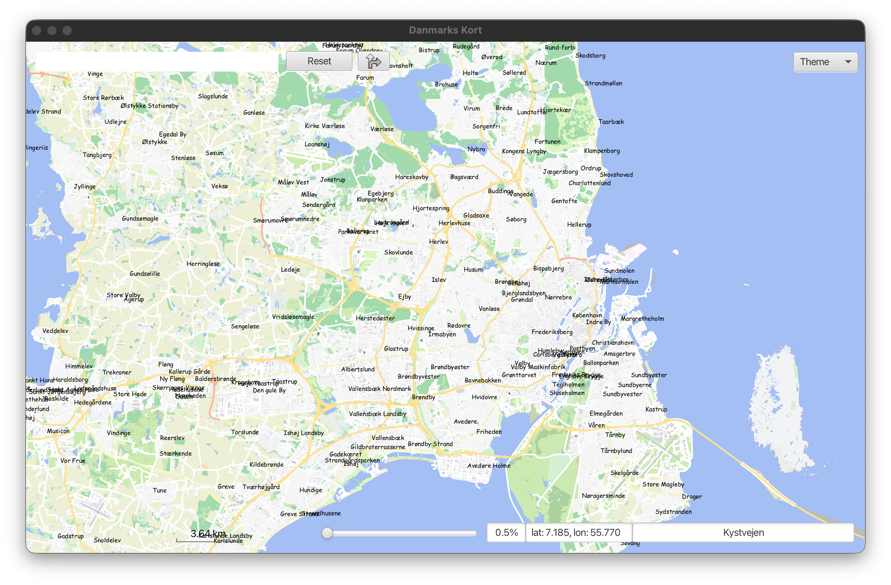
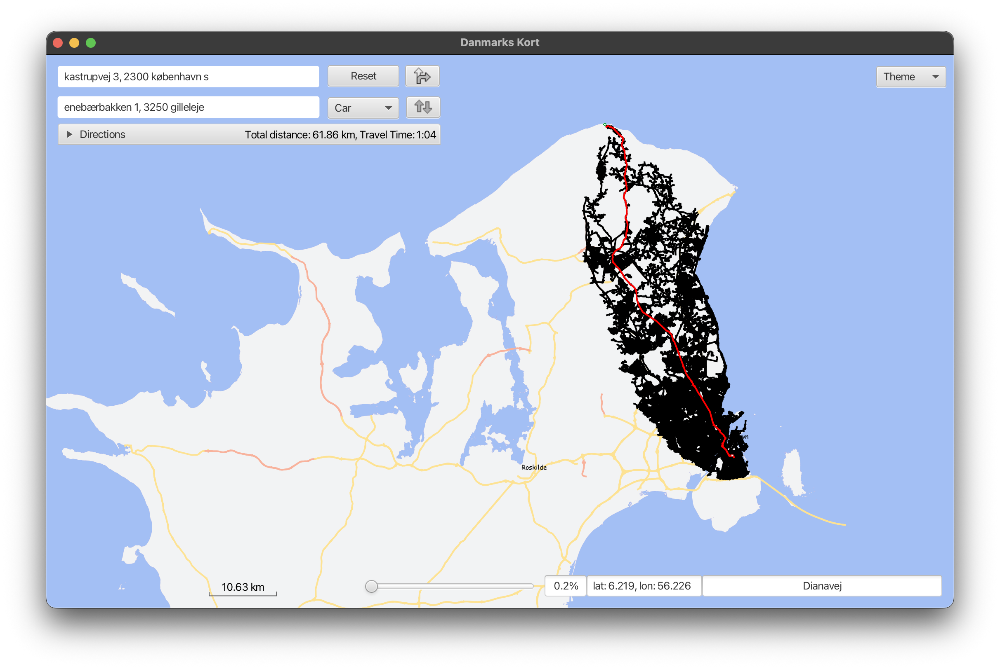
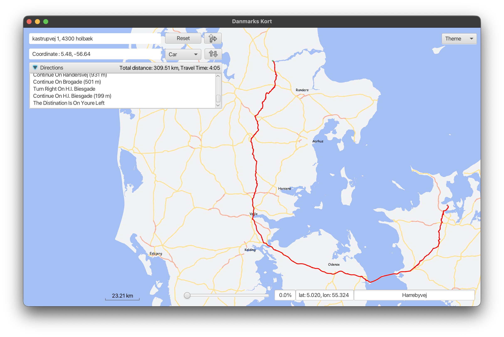

# Map Navigator

## Overview
Map Navigator is a JavaFX application that visualises OpenStreetMap (OSM) data and supports interactive exploration, address lookup, route planning, and custom points of interest. The program parses raw `.osm` or pre-processed `.obj` data, indexes it for fast lookups, and renders it on a hardware-accelerated canvas.



## Feature Highlights
- Interactive pan & zoom map canvas backed by KD-tree accelerated range queries.
- Address and point-of-interest search with Radix tree auto-completion.
- Multi-modal routing (car, bike, walk) with Dijkstra or A* pathfinding and textual directions.
- User-defined favourites via the point-of-interest workflow, persisted between sessions.
- Theme switching (Default, Dark, LSD, NoColor, Simple) and debugging overlays for rendering.
- In-app debugger for selectively toggling way types, inspecting KD-tree splits, and experimenting with routing heuristics.


## Architecture at a Glance
- **App / Main**: JavaFX bootstrap that opens the login scene.
- **Login**: Lets you pick `.osm`, `.zip`, or `.obj` map data before loading the main view.
- **Model / ModelData**: Parses OSM, builds KD-trees, radix tries, graph structures, and caches data to `.obj` binaries and `*_PointOfInterest.obj` files.
- **View & Controller**: FXML-backed main window that wires UI controls, map canvas, routing logic, and user workflows.
- **Graph**: Routing domain model with weighted edges, transport profiles, and both Dijkstra and A* implementations.
- **gui package**: Rendering primitives (`MapCanvas`, `Styler`, `ViewPort`, icons) and draw-time configuration.
- **Util package**: Shared helpers (geometry, collections, formatting) used across the app.



## Data & Assets
- Default assets live under `app/src/main/resources/bfst22/vector` and `app/data`.
- Supported inputs: `.osm`, `.zip`, `.osm.zip`, and cached `.obj` files generated by the parser.
- The importer has been exercised with datasets as large as the [Denmark extract from Geofabrik](https://download.geofabrik.de/europe/denmark.html); once converted to `.osm` it weighs in around 8 GB, so make sure your system has enough disk and heap available.
- A small `gili-islands` sample dataset ships in the repository so you can launch the app immediately after cloning without first downloading a large extract.
- On first load of a raw `.osm`, the app zips the file, parses it, and saves an `.obj` and `*_PointOfInterest.obj` alongside the original to accelerate subsequent launches.
- Closing the main window triggers a save of any new points of interest to the matching `*_PointOfInterest.obj` file.

## Getting Started

### Prerequisites
- JDK 21 (the build uses Gradle toolchains to enforce this).
- JavaFX runtime is pulled automatically via the Gradle OpenJFX plugin.
- ~8 GB of heap (configured via `applicationDefaultJvmArgs = ['-Xmx8144M']`). Adjust if you have different memory constraints.

### Run the Application
```bash
./gradlew run
```
- Loading a raw `.osm` can take several minutes and consumes significant memory. For faster startup during development, re-use the generated `.obj` files.

### Distribute / Package
Build an executable fat JAR with:
```bash
./gradlew :app:shadowJar
```
The artefact is written to `app/build/libs/app-1.0.0-all.jar` and bundles JavaFX modules.

## Usage Guide

### Dataset Selection & Caching
- Pick a dataset from the login screen; progress feedback indicates parsing, KD-tree generation, trie loading, and graph construction stages.
- After the first parse, restart the app and pick the `.obj` for near-instant loading.

### Map Navigation
- Drag with the primary mouse button to pan; use the mouse wheel or zoom slider to zoom.
- The scale bar recalculates distances using haversine math and updates dynamically.
- Coordinate readout and nearest-road information follow the cursor.

### Search & Auto-complete
- Start typing in the "from" or "to" fields to get address and POI suggestions backed by the radix tree.
- Selecting a suggestion pans/zooms to the location, drops markers, and primes the route finder.

### Directions & Routing

- Choose transport mode (car, bike, walk) and algorithm (A* or Dijkstra via the Debugger) to compute routes.
- Results include highlighted routes, textual turn-by-turn guidance, distance, and travel-time estimates that consider speed limits for car routing.
- Right-click the map to set origin/destination from coordinates and open the expanded navigation panel.

### Points of Interest
- Right-click and select "Add Point Of Interest" to name and colour a favourite location.
- POIs are rendered on the map and added to the search radix tree for quick retrieval; they persist between sessions via the `_PointOfInterest.obj` cache.

### Map Themes
- Toggle between the bundled themes from the dropdown in the top-right corner.
- Theme definitions live under `app/src/main/resources/bfst22/vector/theme`; add new `.fxml` files to extend the list.

### Debug Tools & Layer Control

- Open the debugger via the context menu to:
  - Toggle visibility of individual way types (roads, landuse, water, etc.).
  - Visualise KD-tree splits and viewport bounds.
  - Switch routing algorithms, transport mode, and shortest/fastest preferences on the fly.
  - Inspect frame rate and current routing start/end coordinates.

## Testing
```bash
./gradlew test
```
- Tests cover OSM parsing utilities, KD-tree and radix data structures, routing, and viewport maths.
- Two `NumberFormatterTest` cases expect locales that use commas as decimal separators. If your default locale uses dots, run tests with `./gradlew test -Duser.language=da -Duser.country=DK` or adjust the expectations.

## Acknowledgements
- OpenStreetMap contributors for the dataset.
- OpenJFX community for the JavaFX runtime.